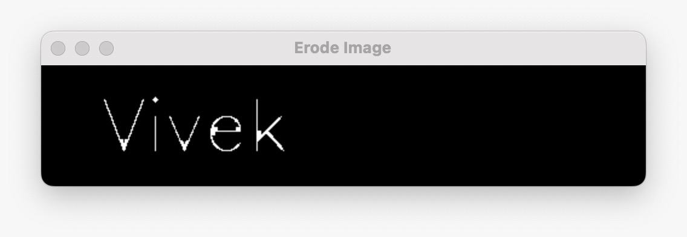

# Implementation-of-Erosion-and-Dilation
## Aim
To implement Erosion and Dilation using Python and OpenCV.
## Software Required
1. Anaconda - Python 3.7
2. OpenCV
## Algorithm:
### Step1:
1. Import the necessary packages to do Erosion and Dilution.

### Step2:
2. Create the text image of our name using putText from cv2 package.

### Step3:
3. Create the required structural element.

### Step4:
4. Apply Erode and Dilution for our NameImage
### Step5:
5. Display the output images.
### step6:
6. End the program.
 
## Program:

# Import the necessary packages

import cv2
import numpy

# Create the Text using cv2.putText
~~~
NameImage = numpy.zeros((100,1000),dtype='uint8')
font = cv2.FONT_ITALIC
cv2.putText(NameImage,'vivek',(50,70),font,2,(255),5,cv2.LINE_4)
cv2.imshow("Name Image",NameImage)

# Create the structuring element

kernel1 = cv2.getStructuringElement(cv2.MORPH_CROSS,(7,7))

# Erode the image

erodeImage = cv2.erode(NameImage,kernel1)

# Dilate the image

dilationImage = cv2.dilate(NameImage,kernel1)

# Displaying the image
cv2.imshow("Name Image",NameImage)
cv2.imshow("Erode Image",erodeImage)
cv2.imshow("Dilated Image",dilationImage)
~~~
### Output:

### Display the input Image

### Display the Eroded Image

### Display the Dilated Image

## Result
Thus the generated text image is eroded and dilated using python and OpenCV.
